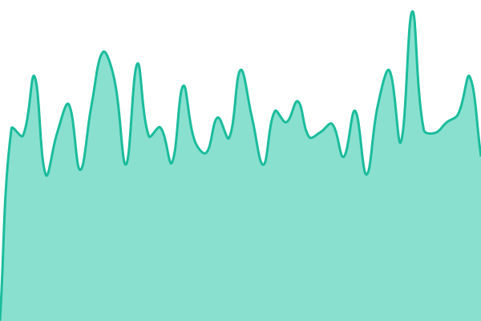
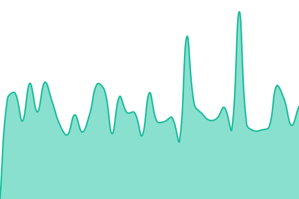
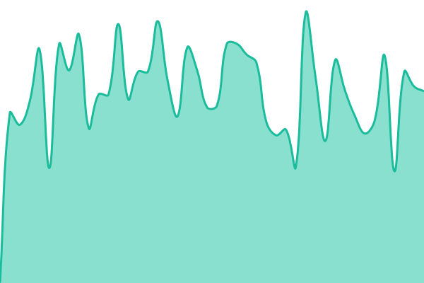
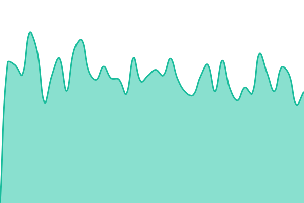

# [📈 Live Status](https://upptime.github.io/upptime): <!--live status--> **🟩 All systems operational**

This repository contains the open-source uptime monitor and status page for [Upptime](https://upptime.js.org), powered by [Upptime](https://github.com/upptime/upptime).

With [Upptime](https://upptime.js.org), you can get your own unlimited and free uptime monitor and status page, powered entirely by a GitHub repository. We use [Issues](https://github.com/upptime/upptime/issues) as incident reports, [Actions](https://github.com/bcenou/OEStatus/actions) as uptime monitors, and [Pages](https://upptime.github.io/upptime) for the status page.

<!--start: status pages-->
<!-- This summary is generated by Upptime (https://github.com/upptime/upptime) -->
<!-- Do not edit this manually, your changes will be overwritten -->
<!-- prettier-ignore -->
| URL | Status | History | Response Time | Uptime |
| --- | ------ | ------- | ------------- | ------ |
|  [OpenEdition](https://www.openedition.org) | 🟩 Up | [open-edition.yml](https://github.com/OpenEdition/OEStatus/commits/HEAD/history/open-edition.yml) | 

 1127ms
     
 | 

<a href="https://OpenEdition.github.io/OEStatus/history/open-edition">97.51%</a>
    

|  [OpenEdition Journals](https://journals.openedition.org) | 🟩 Up | [open-edition-journals.yml](https://github.com/OpenEdition/OEStatus/commits/HEAD/history/open-edition-journals.yml) | 

 1022ms
     
 | 

<a href="https://OpenEdition.github.io/OEStatus/history/open-edition-journals">97.60%</a>
    

|  [OpenEdition Books](https://books.openedition.org) | 🟩 Up | [open-edition-books.yml](https://github.com/OpenEdition/OEStatus/commits/HEAD/history/open-edition-books.yml) | 

 1523ms
     
 | 

<a href="https://OpenEdition.github.io/OEStatus/history/open-edition-books">97.70%</a>
    

|  [Hypothèses](https://hypotheses.org) | 🟩 Up | [hypotheses.yml](https://github.com/OpenEdition/OEStatus/commits/HEAD/history/hypotheses.yml) | 

 1097ms
     
 | 

<a href="https://OpenEdition.github.io/OEStatus/history/hypotheses">97.90%</a>
    

|  [Calenda](https://calenda.org) | 🟩 Up | [calenda.yml](https://github.com/OpenEdition/OEStatus/commits/HEAD/history/calenda.yml) | 

 1550ms
     
 | 

<a href="https://OpenEdition.github.io/OEStatus/history/calenda">97.95%</a>
    

<!--end: status pages-->

[**Visit our status website →**](https://upptime.github.io/upptime)

## 📄 License

- Powered by: [Upptime](https://github.com/upptime/upptime)
- Code: [MIT](./LICENSE) © [Upptime](https://upptime.js.org)
- Data in the `./history` directory: [Open Database License](https://opendatacommons.org/licenses/odbl/1-0/)
